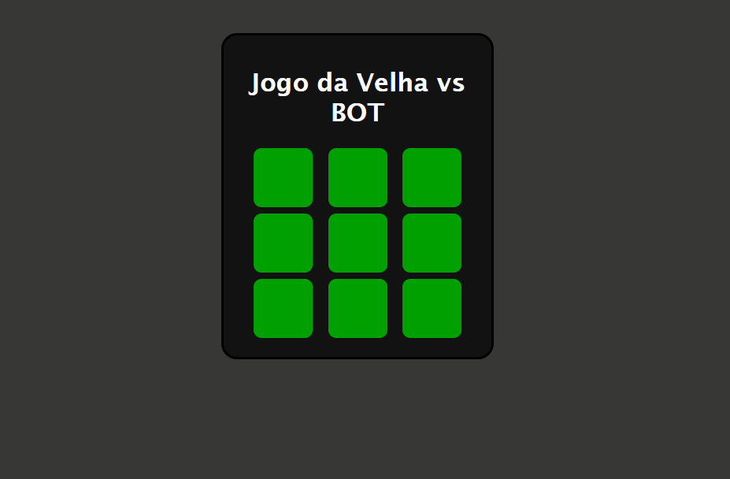

<h1 align="center">Jogo da velha vs Bot</h1>

 
 
  
  

  
  
 Este projeto foi feito atraves dos conhecimentos de JS, HTML, CSS.
 

 
 

  <a href= '#sobre'> Sobre </a> &nbsp;&nbsp;|&nbsp;&nbsp;
 <a href= '#demonstração'> Demonstração </a> &nbsp;&nbsp;|&nbsp;&nbsp;
 <a href= '#autor'> autor </a> &nbsp;&nbsp;|&nbsp;&nbsp;
 <a href= '#tecnologias'> Tecnologias </a> &nbsp;&nbsp;|&nbsp;&nbsp;
 

 
 
 ### Sobre
 
 O clássico jogo da velha com o player jogando contra um bot criado em JavaScript
 
 
 ### Demonstração
 
 
 
 <a href=https://luan400.github.io/Jogo-da-velha-vs-bot/>Teste</a>

 
 
### Tecnologias

As seguintes ferramentas foram usadas na construção do projeto:

<ul>
<li>HTML5</li>
<li>CSS3</li>
<li>JAVASCRIPT</li>
</ul>

 
 # Autor 
 
 Produzido e elaborado por <a href='https://www.instagram.com/luanbortoleto/'>Luan Bortoleto</a>, programador Full Stack.

